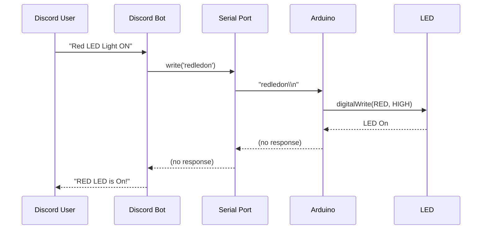

# Arduino LED Control via Discord Bot

Control LEDs connected to an Arduino via a Discord bot using serial communication.

## Diagram




## Wiring

- **Blue LED** → Pin 5
- **Red LED** → Pin 4
- **Green LED** → Pin 3
- **Yellow LED** → Pin 2

Connect each LED anode (`+`) to the corresponding pin and cathode (`-`) to GND via a 220Ω resistor.

## Setup

### 1. Clone & Install

```bash
git clone <repo-url>
cd arduino-control-with-discord-js-bot-main
npm install
```

### 2. Environment

Create a `.env` file in the project root:

```env
TOKEN=your_discord_bot_token_here
```

### 3. Arduino

Upload `led-code.ino` to your Arduino board using the Arduino IDE.

### 4. Run

```bash
npm start
```

On startup, the bot lists all available serial ports and prompts you to select one.

## Commands

- **`Blue LED Light ON`** — Turn blue LED on
- **`Blue LED Light OFF`** — Turn blue LED off
- **`Red LED Light ON`** — Turn red LED on
- **`Red LED Light OFF`** — Turn red LED off
- **`Green LED Light ON`** — Turn green LED on
- **`Green LED Light OFF`** — Turn green LED off
- **`Yellow LED Light ON`** — Turn yellow LED on
- **`Yellow LED Light OFF`** — Turn yellow LED off

## Dependencies

- [discord.js](https://discord.js.org/) v14 — Discord API
- [serialport](https://serialport.io/) — Serial communication
- [dotenv](https://github.com/motdotla/dotenv) — Environment variables

